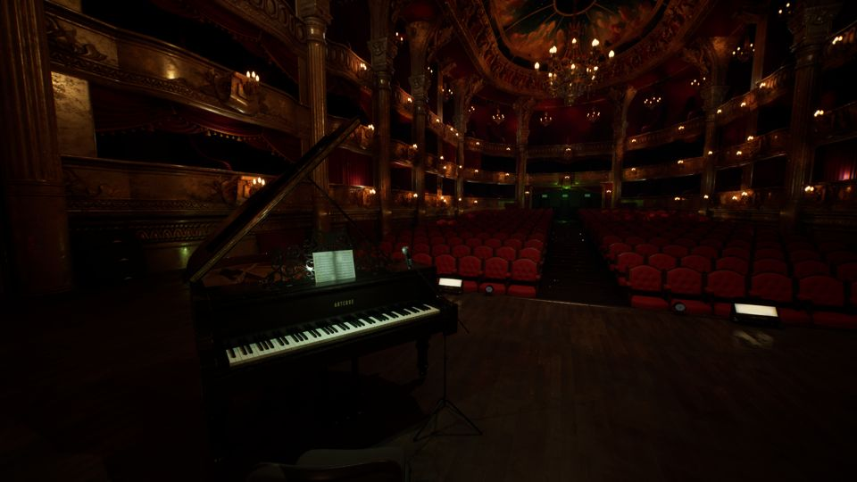
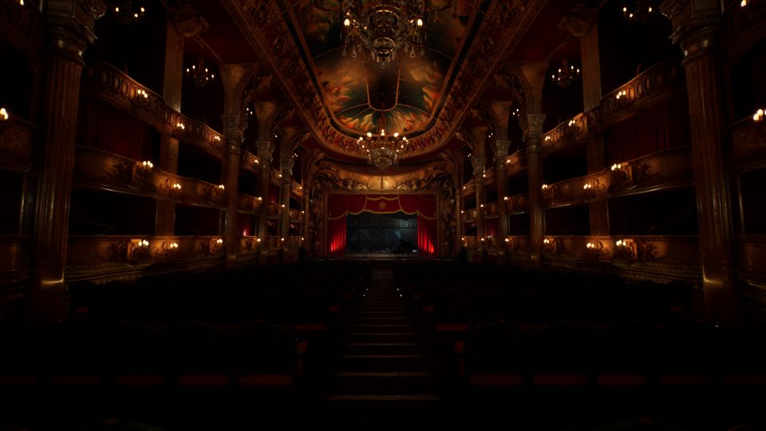
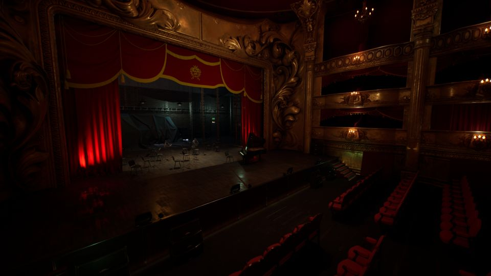

<link rel="stylesheet" href="../assets/styles.css">
<link rel="icon" href="/biggest-piano/assets/favicon.png" type="image/png">

<header>
  
</header>

# このピアノ、何かがおかしい。

ようこそ、特別なコンサートへ。

**『Biggest Piano』**はピアノがどんどん大きくなる違和感から始まる、短編×コミカルホラーです。

##  ゲーム紹介

霊能探偵・三田の元に届いた一通の手紙。

手紙の送り主は、音大生ショウコ。

閉鎖されたオペラ館で起こる異変に挑むため、協力者のタケル・マコトと共に探索を開始する。

しかしその静けさが、すでに異常だった──。

巨大化するピアノ。
現れる演奏者。
止まらない演奏。

果たして、ピアノの呪いを止めることはできるのか。

> **笑えるのに怖い、怖いのになぜか笑える。でも本当は、怖くない。**

---

##  ゲームスクリーンショット

    

        
    

    

        
    

    

        
    

    

        
        
        
    

---

##  プレイ時間・操作

- プレイ時間：約20分
- 操作：マウス＋WASD移動のみ
- エンディング：2種類（GOOD / BAD）

---

##  無料で遊べます！

- Steam版：[リンクをここに貼ってください]
- ZIP版（ダウンロード）：[準備中 or URLをここに記載]

---

##  配信について

配信・実況は大歓迎です！

---






