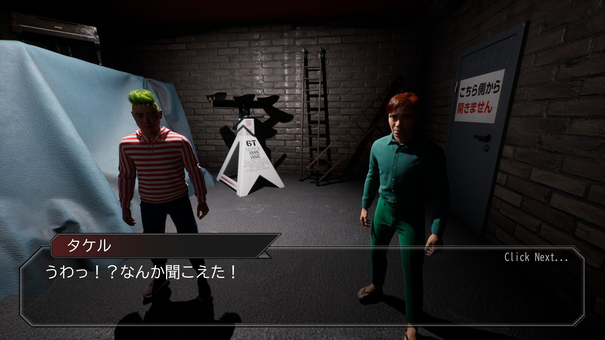

<link rel="stylesheet" href="../assets/styles.css">
<link rel="icon" href="/biggest-piano/assets/favicon.png" type="image/png">

<header>
  
</header>

<iframe src="https://store.steampowered.com/widget/3822430/" frameborder="0" width="646" height="190"></iframe>

# このピアノ、何かがおかしい。

---

特別なコンサートへ、ようこそ。

> **ピアノが大きすぎる——というただそれだけの違和感から始まる、短編×コミカルホラーです**

##  ゲーム紹介

探偵・大田の元に届いた、一通の奇妙な手紙。

手紙の主は音大に通うピアニスト、ショウコ。

舞台はコンサートホール。絶賛営業中の普通の施設に見えるが……  
協力者のタケル・マコトと共に施設を探索するが、目立った異変は見当たらない。  
だが、その“静けさ”こそが異常だった。

巨大化するピアノ。  
音に引き寄せられるように現れる、演奏をやめない“何か”。

笑えるのに怖い、怖いのになぜか笑える。  
でも本当は、怖くない。

ピアノの呪いに立ち向かい、ショウコを救えるか？

> **五感のすべてが奏でる———ニゲロ**
> **もう誰にも止められない**
> **今、もっとも目が離せないコンサートが開演する**

---

## 恐怖はフォルティシモ。真の休符は訪れるのか？

- エンディングはビッグに2種類！
- 簡単操作でビッグに遊べ！マウス視点操作とWASD移動のみ！
- 楽しさビッグ級！なのにビッグに無料！

> ※ホラーとコメディの境界を見失いながら制作したため、  
> “ピアノ”が開発者の想定していないサイズになる不具合が発生することがあります。  
> 発生した場合はお手数ですが、レビューに「ピアノのサイズ」を記載してください。

---

##  ゲームスクリーンショット

    

        
    

    

        
    

    

        
    

    

        
    

    

        
    

    

        
        
        
        
        
    

---

##  プレイ時間・操作

- プレイ時間：約20分
- 操作：マウス or マウス＋WASD移動
- エンディング：2種類（GOOD / BAD）

---



---



---



---



---

